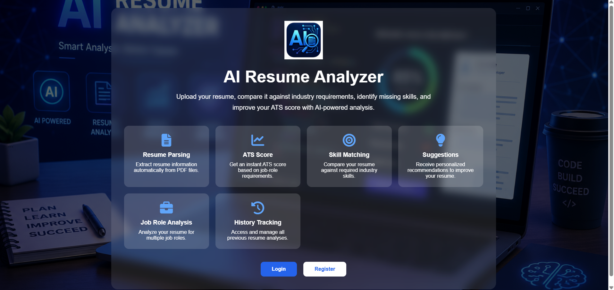
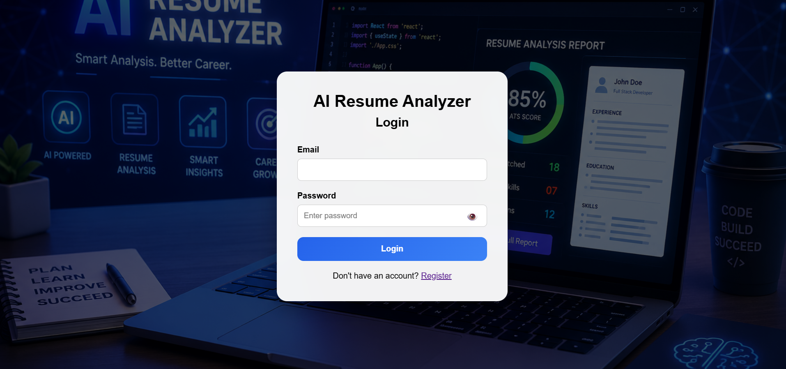
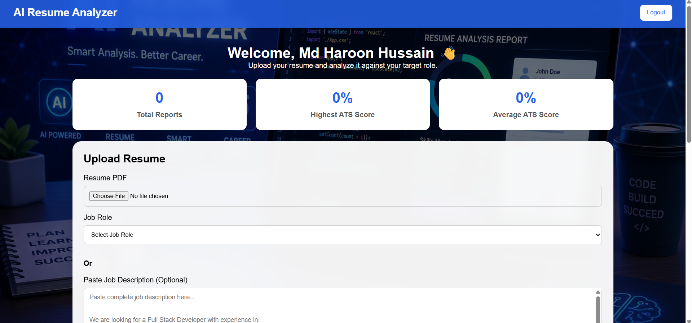
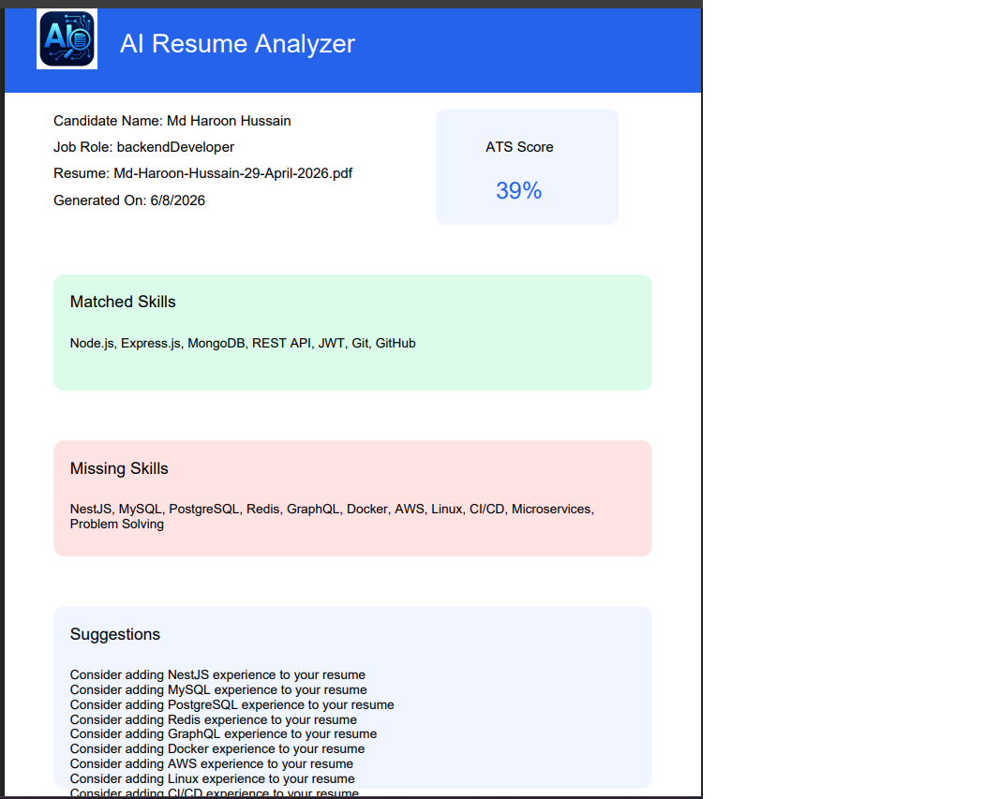

# 🚀 AI Resume Analyzer

AI Resume Analyzer is a Full Stack MERN-style application that analyzes resumes against job roles or custom job descriptions (JD) and generates an ATS (Applicant Tracking System) compatibility score.

The application helps job seekers identify missing skills, improve their resumes, and understand how well their resume matches a target job.

---

## ✨ Features

### Authentication

- User Registration
- User Login
- JWT Authentication
- Protected Routes
- Logout Functionality

### Resume Analysis

- Upload PDF Resume
- Extract Resume Text Automatically
- Analyze Resume Against Predefined Job Roles
- Analyze Resume Against Custom Job Descriptions
- ATS Score Calculation
- Matched Skills Detection
- Missing Skills Detection
- Resume Improvement Suggestions

### Dashboard

- ATS Score Progress Circle
- Dynamic Score Coloring
- Analysis History
- View Previous Reports
- Delete Reports
- Dashboard Statistics

### PDF Report

- Download Professional ATS Report
- Candidate Information
- ATS Score
- Matched Skills
- Missing Skills
- Suggestions

### UI Features

- Responsive Design
- Custom Modals
- Toast Notifications
- Professional Landing Page

---

## 🛠️ Tech Stack

### Frontend

- HTML5
- CSS3
- JavaScript (Vanilla JS)

### Backend

- Node.js
- Express.js

### Database

- MongoDB Atlas
- Mongoose

### Authentication

- JWT (JSON Web Token)
- bcryptjs

### File Handling

- Multer
- PDF-Parse

### PDF Report

- jsPDF

---

## 📂 Project Structure

```text
AI-RESUME-ANALYZER
│
├── backend
│   ├── config
│   ├── controllers
│   ├── middleware
│   ├── models
│   ├── routes
│   ├── services
│   ├── uploads
│   ├── utils
│   ├── server.js
│   └── package.json
│
├── frontend
│   ├── assets
│   ├── css
│   ├── js
│   ├── index.html
│   ├── login.html
│   ├── register.html
│   └── dashboard.html
│
└── README.md
```

---

## ⚙️ Installation Guide

### 1. Clone Repository

```bash
git clone https://github.com/YOUR_USERNAME/AI-Resume-Analyzer.git
```

### 2. Move Into Project

```bash
cd AI-Resume-Analyzer
```

---

## Backend Setup

### Install Dependencies

```bash
cd backend
npm install
```

### Create Environment File

Create a `.env` file inside the backend folder.

```env
PORT=5000

MONGO_URI=YOUR_MONGODB_ATLAS_CONNECTION_STRING

JWT_SECRET=YOUR_SECRET_KEY
```

### Start Backend Server

```bash
npm run dev
```

You should see:

```text
Server is running on port 5000
MongoDB Connected
```

---

## Frontend Setup

Open the frontend folder in VS Code.

Install the Live Server extension.

Right-click:

```text
frontend/index.html
```

and select:

```text
Open with Live Server
```

The application will run at:

```text
http://127.0.0.1:5500
```

---

## How To Use

### Step 1

Register a new account.

### Step 2

Login using your credentials.

### Step 3

Upload a PDF Resume.

### Step 4

Select a Job Role OR paste a custom Job Description.

### Step 5

Click:

```text
Analyze Resume
```

### Step 6

View:

- ATS Score
- Matched Skills
- Missing Skills
- Suggestions

### Step 7

Download a Professional PDF Report.

---

## ATS Score Logic

The ATS score is calculated based on skill matching.

Formula:

```text
ATS Score =
(Matched Skills / Total Required Skills) × 100
```

Example:

```text
Required Skills = 10
Matched Skills = 7

ATS Score = 70%
```

---

## Screenshots

Add screenshots here after uploading them to GitHub.

### Landing Page



### Login Page



### Dashboard



### PDF Report



---

## Future Improvements

- AI-Powered Resume Suggestions
- Resume Keyword Optimization
- Resume Ranking
- Multiple Resume Comparison
- Export Reports to Cloud
- Resume Improvement Recommendations using Generative AI

---

## Author

**Md Haroon Hussain**

GitHub: https://github.com/mdharoonhussain

LinkedIn:(http://linkedin.com/in/md-haroon-hussain-b730561b3)

---

## License

This project is developed for educational and portfolio purposes.
